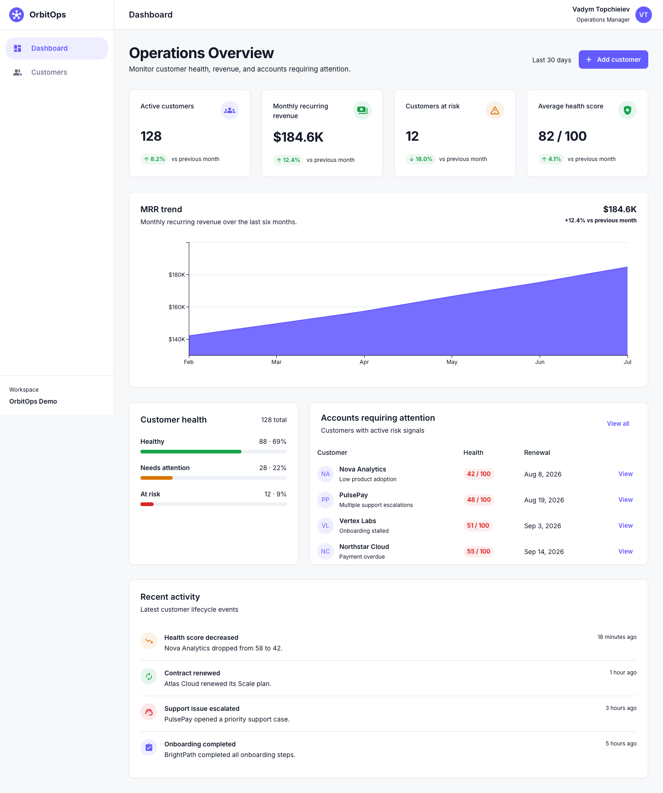
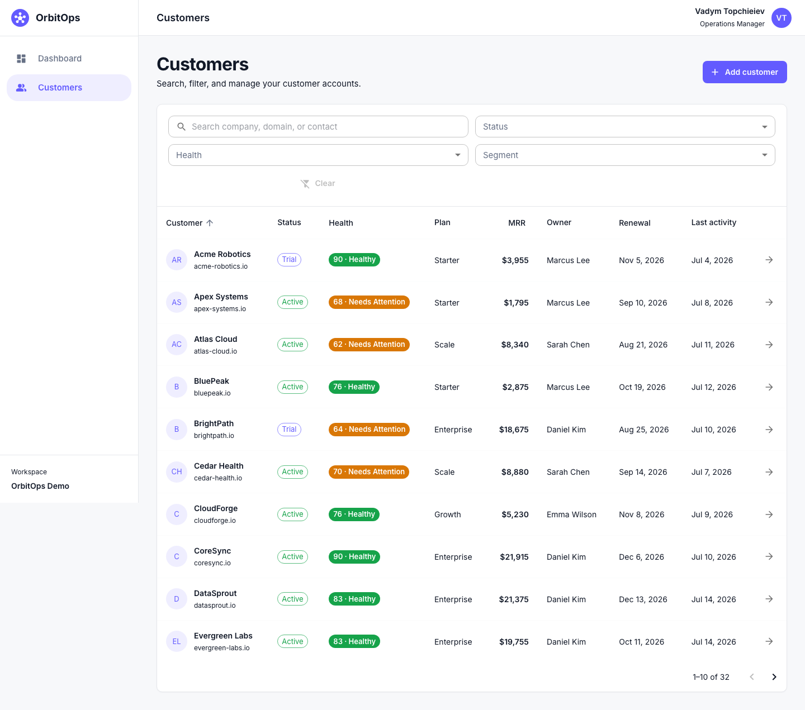
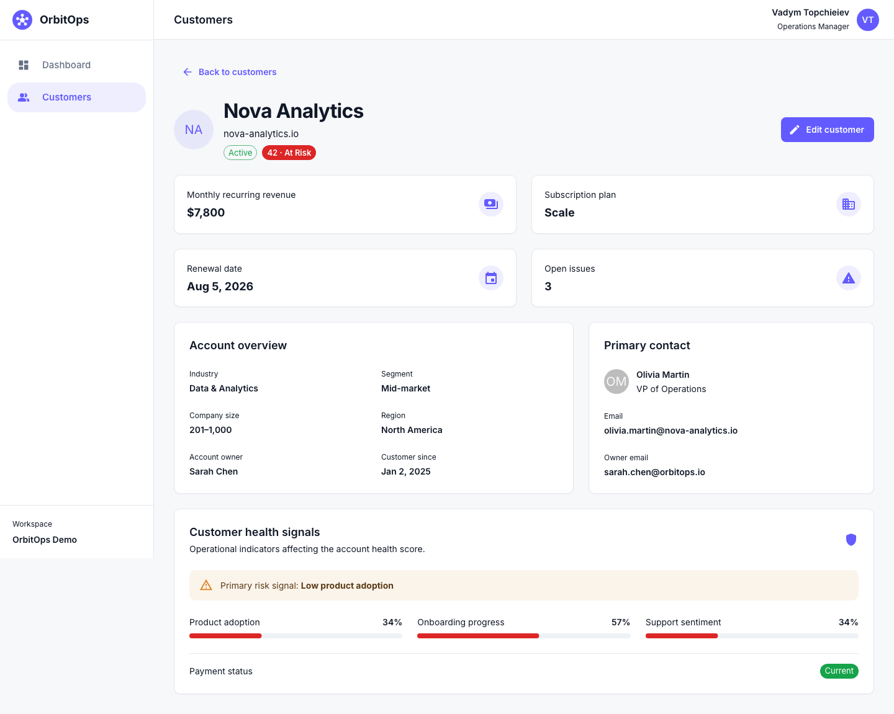
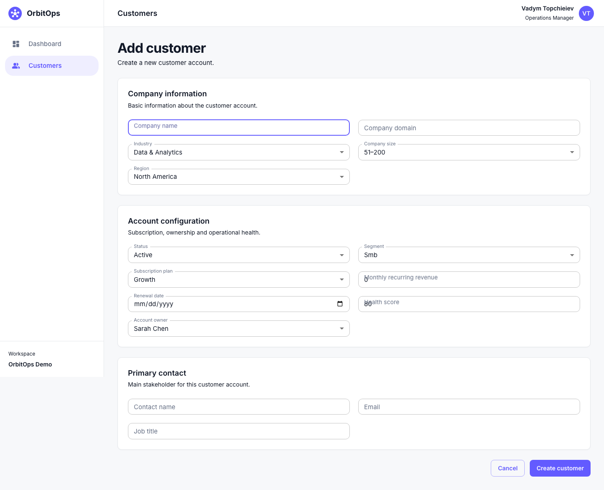
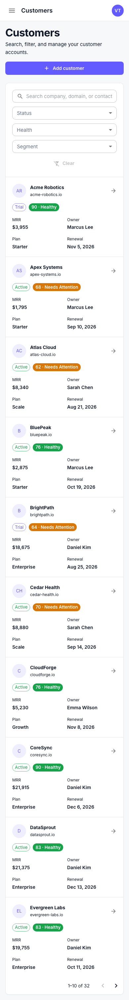
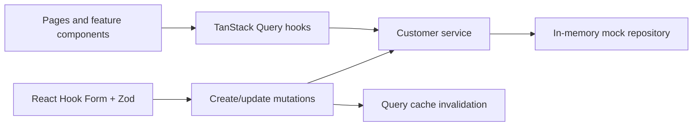

# OrbitOps

OrbitOps is a responsive B2B SaaS customer operations dashboard for monitoring account health, recurring revenue, renewals, and customers requiring attention.

Built as a focused portfolio project, it demonstrates production-oriented frontend architecture and realistic product workflows without requiring a backend.



## Product highlights

- Operations dashboard with KPIs, an MRR trend chart, health distribution, risk accounts, and recent activity
- Customer workspace with debounced search, filters, sorting, pagination, and URL-synchronized state
- Detailed account profiles with health signals, commercial data, contacts, and operational context
- Reusable create/edit flow with React Hook Form and Zod validation
- Simulated API latency, query caching, mutations, loading, error, empty, and no-results states
- Dedicated mobile customer cards and responsive layouts across the application
- Component documentation in Storybook and critical user-flow coverage with Playwright

## Screens

| Customer management | Customer details |
| --- | --- |
|  |  |

| Create customer | Mobile experience |
| --- | --- |
|  |  |

## Tech stack

- Next.js 16 App Router, React 19, TypeScript
- Material UI and MUI X Charts
- TanStack Query
- React Hook Form and Zod
- Storybook with accessibility tooling
- Playwright

## Architecture



The UI consumes a typed asynchronous service rather than importing fixtures directly. This keeps fetching, filtering, sorting, pagination, and mutations behind an API-like boundary that can later be replaced by a real backend.

Feature code is grouped by domain:

```text
src/
├── app/                         # Routes and layouts
├── features/
│   ├── customers/               # Models, service, hooks, UI, schemas
│   └── dashboard/               # Dashboard data and components
├── shared/                      # App shell, providers, shared hooks
└── theme/                       # MUI design system
```

## Routes

| Route | Purpose |
| --- | --- |
| `/dashboard` | Operations overview |
| `/customers` | Searchable and filterable customer workspace |
| `/customers/new` | Create customer flow |
| `/customers/[customerId]` | Customer details |
| `/customers/[customerId]/edit` | Edit customer flow |

## Local setup

Requirements: Node.js 20+ and npm.

```bash
git clone git@github.com:TopVV/orbitops.git
cd orbitops
npm install
npm run dev
```

Open [http://localhost:3000](http://localhost:3000).

## Quality commands

```bash
npm run lint              # ESLint
npm run build             # Production Next.js build
npm run storybook         # Component workshop on port 6006
npm run build-storybook   # Static Storybook build
npm run test:e2e          # Playwright user flows
npm run screenshots       # Regenerate portfolio screenshots
```

The Playwright suite covers two core flows:

1. Search and filter customers, then open an account.
2. Trigger form validation, create a customer, and verify the resulting account.

## Intentional scope

OrbitOps is a frontend showcase, so authentication, a database, billing, permissions, and a production API are intentionally excluded. Customer changes live in memory and reset when the application process restarts.

This keeps the project focused on the parts most relevant to complex SaaS frontend work: information architecture, data-heavy UI, async state, forms, responsive behavior, accessibility, and testing.
